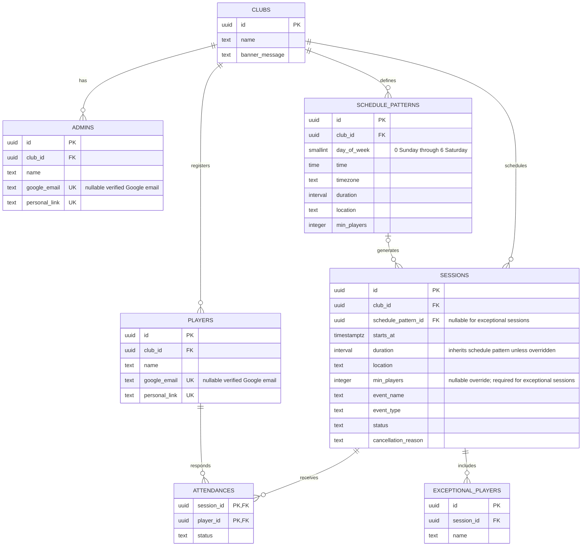

# PlayCount - Functional Requirements Specification

Final functional design, consolidated from the agreed requirements and subsequent changes.

## 1. Product Overview

PlayCount is a mobile-first web application for sports clubs. It allows players to see upcoming sessions and declare their attendance, while club administrators manage schedules, exceptional events, players, administrators, and attendance.

Each club uses its own application deployment and Supabase project.

## 2. User Roles

### 2.1 Player

- Can access the application through a personal direct link. Google sign-in is preferred when the player's Google identity is associated with their profile.
- A player does not need a Google identity; an administrator can add the player by name and share the generated personal link.
- Can see upcoming sessions for the club.
- Can set and change their own attendance status for each session.
- Can only manage their own attendance information.
- Cannot add guests or other participants.

### 2.2 Administrator

- Can access the application through a personal direct link or Google sign-in when a Google identity is associated with the admin profile.
- A Google identity is optional for an administrator; an administrator without one signs in using their personal direct link.
- Can manage the club configuration and recurring schedule.
- Can create, modify, and cancel sessions.
- Can create exceptional training sessions or matches that do not follow the recurring weekly pattern.
- Can manage players and administrators.
- Can view the personal access links of all players in the club.
- Can add exceptional participants/guests to a specific session. These people do not have a login.
- Can add, modify, and remove exceptional participants for a session.

## 3. Authentication and Access

- A personal direct link contains a secure token and provides access without requiring Google sign-in.
- Players can use Google sign-in only when their Google identity is associated with their player profile. After successful Google sign-in, the browser redirects to that player's personal direct link.
- Players without an associated Google identity use their personal link, which an administrator can share with them.
- Administrators can use their personal admin link whether or not they have a Google identity. An admin with an associated Google identity can also sign in with Google.
- After successful Google sign-in for an admin, the browser redirects to that admin's personal admin link.
- Admin personal links and player personal links are distinct: an admin link grants admin permissions, while a player link grants access only to that player's own attendance.
- Administrators can view and share players' personal links when needed.
- Google sign-in matches the profile using the verified Google email stored on the player or admin profile. Supabase Auth is not used.
- Google sign-in and personal links resolve to the same corresponding account and permissions.

## 4. Club Configuration and Deployment

- Each club has its own name, recurring schedules, players, administrators, and announcement/banner.
- Each deployment serves one club, with that club's data stored in its dedicated Supabase project.
- The application is generic and must not contain club-specific functional logic such as assuming that all sessions occur on Saturday.
- Each club has its own application instance/subdomain on Cloudflare; a purchased custom domain is not required.

## 5. Recurring Schedule

- A club can define one or more recurring weekly session patterns.
- Each pattern contains the day of week, default time, default duration, and default location.
- Each pattern has its own minimum required number of participants.
- The application automatically generates upcoming sessions from these recurring patterns.
- The upcoming sessions are ordered chronologically.
- The system must support different patterns for the same club, for example Thursday and Saturday sessions.
- The interface must use dynamic dates and session information rather than hard-coded wording such as "Saturday".

## 6. Exceptional Sessions

- An administrator can manually create an exceptional session.
- An exceptional session can be a training session, match, or other relevant sporting event.
- An exceptional session does not need to follow any recurring weekly pattern.
- The administrator defines at least the date, time, duration, location, and session/event type or name.
- Exceptional sessions appear in the same chronological session list as recurring sessions.
- They use the same attendance/RSVP mechanism as regular sessions.
- Exceptional sessions can subsequently be modified or cancelled by an administrator.

## 7. Session Exceptions and Cancellation

- For a generated recurring session, an administrator can override the default time for that specific date.
- For a generated recurring session, an administrator can override the default duration for that specific date.
- For a generated recurring session, an administrator can override the default location for that specific date.
- An administrator can cancel an individual session.
- A cancelled session can have a cancellation reason.
- Cancellation affects the individual session only and does not change the recurring weekly pattern.

## 8. Attendance / RSVP

- For each upcoming session, a registered player can select one of three statuses: Présent, Incertain, or Absent.
- The player can change their response later.
- The player's response is associated with the specific session.
- A player cannot add guests to their response.
- Attendance information is visible in the session attendance view.

## 9. Exceptional Participants / Guests

- Only an administrator can add exceptional participants to a session.
- Exceptional participants are not registered club players.
- Exceptional participants do not have a login, personal link, or Google account association.
- An administrator can add one or more exceptional participants to a specific session.
- Exceptional participants are displayed distinctly from registered players.
- Their participation contributes to the total participant count for that session.
- The administrator can modify or remove exceptional participants from the session.

## 10. Minimum Participation and Viability

- Each recurring schedule pattern has its own configurable minimum number of participants.
- A session uses its schedule pattern's minimum unless a session-specific minimum is set. An exceptional session without a recurring pattern must define its own minimum.
- The application calculates the total confirmed participants for a session from registered players marked Présent plus exceptional participants added by the administrator.
- The session view displays the current total against that session's minimum.
- A visual progress indicator shows whether the minimum threshold has been reached.

## 11. Main Attendance Interface

The principal attendance view is a chronological attendance matrix designed for efficient use on a phone and, where appropriate, on larger screens.

- Columns represent sessions/events, sorted by date from earliest to latest.
- The session columns can be scrolled horizontally.
- When the page opens, horizontal scrolling is positioned on the next upcoming session.
- Rows represent registered players.
- Each player/session cell displays the player's current attendance status.
- Exceptional participants added by an administrator are displayed as separate participant rows and are visually distinguishable from registered players.
- The matrix allows the administrator to see multiple future sessions and the attendance status of all players in one view.
- The same underlying attendance information is used by the player-facing view, while players only control their own status.

## 12. Real-Time Attendance Information

- The attendance roster updates dynamically when player responses change.
- The session total and minimum-participation indicator reflect the current attendance data.
- Administrators can see the current attendance state across upcoming sessions.

## 13. Club Administration

- Administrator can configure the club name.
- Administrator can configure the minimum required number of participants for each recurring schedule pattern.
- Administrator can add, modify, or remove recurring weekly session patterns.
- Administrator can configure the default time and location for each recurring pattern.
- Administrator can create exceptional sessions/events.
- Administrator can modify or cancel sessions.
- Administrator can manage the club's players.
- Administrator can manage other club administrators.
- Administrator can manage the club announcement/banner.
- Administrator can view players' personal direct links.

## 14. Club Announcement / Banner

- A club administrator can define an announcement message.
- The announcement is displayed prominently in the player-facing session view.
- The announcement is associated with the club rather than with an individual player.

## 15. Administrator Management

- A club can have multiple administrators.
- An existing administrator can add another administrator by name; the application generates a personal admin link that can be shared with them.
- A Google identity/email can optionally be associated with an admin profile for Google authentication.
- Administrators have elevated permissions for their club only.

## 16. Functional Data Model

| Entity | Purpose | Key functional information |
| --- | --- | --- |
| Club | Club configuration | Name, announcement |
| Recurring Schedule | Weekly pattern | Day, time, timezone, duration, location, minimum participants |
| Player | Registered participant | Name, personal access link, optional Google identity |
| Administrator | Club administrator | Name, personal admin link, optional Google identity |
| Session | Concrete event | Date/time, duration, location, optional minimum override, planned/cancelled, cancellation reason, regular/exceptional |
| Attendance | Player response | Session, player, Présent/Incertain/Absent |
| Exceptional Player | Admin-added participant | Session and name; participation is implicit; no login |

### Draft Supabase Schema

Each club deployment contains one club configuration. Google sign-in matches profiles by their verified Google email; Supabase Auth is not used.

The application should enforce one club configuration per deployment, unique verified Google email per player or admin when present, unique personal links, and one attendance response per player/session. Both `PLAYERS` and `ADMINS` store the personal link directly in a unique `personal_link` column. These links are bearer credentials; restrict database access and never expose them in public queries. A player link must never grant admin permissions.

## 17. Database Schema Management

- Each club has an isolated Supabase CLI project and timestamped migration directory under `instances/<club>/supabase/`.
- The La Manchette workflow applies only `instances/lamanchette/supabase/migrations/` to the La Manchette project when those files change on `main`; it can also be started manually.
- The La Manchette workflow uses the protected GitHub environment `supabase-playcount-lamanchette` with its own `SUPABASE_ACCESS_TOKEN`, `SUPABASE_PROJECT_REF`, and `SUPABASE_DB_PASSWORD` secrets.
- The workflow links the Supabase CLI to that project and runs `supabase db push --linked --yes`; a failed migration fails the workflow.
- The migrations create the documented tables and seed La Manchette with a Saturday 10:00 two-hour schedule in `Europe/Brussels` at Centre sportif de Blocry, with an eight-player minimum. The first admin is Maximilian Barais (`mikebarais@gmail.com`).
- Each recurring schedule stores its own IANA timezone; generated session timestamps use the timezone of their schedule pattern.
- Row-level security is enabled on all tables. No browser-access policies are included yet, so client access remains blocked until authorization policies are defined.
- The initial migration targets a new, empty project. An existing database must be reviewed and baselined before the workflow runs against it.

## 18. Explicitly Removed from the Final Design

- Players cannot add +1/+2 guests.
- There is no player-owned guest count.
- Exceptional participants are controlled exclusively by administrators.
- A custom purchased domain is not a functional requirement.
- A "generate WhatsApp links" feature is not part of the agreed baseline.
- General infrastructure, application deployment tooling, and database keep-alive mechanisms are outside the functional requirements. Database schema migrations remain a technical delivery requirement as described above.

## 19. Final Product Behaviour - Summary

PlayCount provides each club with a configurable recurring schedule plus the ability to create exceptional trainings and matches. Players access their club through either Google authentication or a personal direct link and manage only their own attendance. Administrators have broader control: they manage schedules, sessions, players, administrators, announcements, and exceptional participants, and can retrieve players' personal links. The main attendance view is a horizontally scrollable chronological matrix, with sessions as columns and players as rows, initially positioned on the next upcoming session.